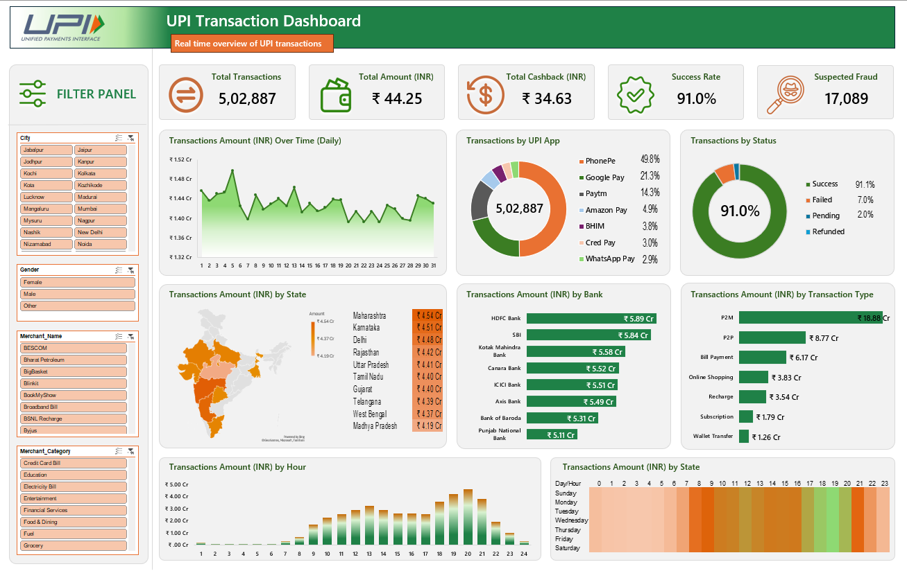

# UPI Transaction Analytics Dashboard

An Excel-based data analytics project built using **500,000+ UPI transaction records** to analyze transaction patterns, payment behavior, transaction volume, transaction values, and time-based activity.

The project demonstrates how large-scale transactional data can be cleaned, analyzed, summarized, and transformed into an interactive business dashboard using Microsoft Excel.

---

## Dashboard Preview



---

## Project Overview

The objective of this project is to analyze UPI transaction data and identify meaningful patterns in transaction activity.

The analysis focuses on transaction volume, transaction amounts, time-based trends, payment behavior, and category-level performance.

The project uses Excel PivotTables, calculated metrics, `GETPIVOTDATA`, and interactive dashboard components to convert raw transactional data into a business-focused analytical report.

---

## Dataset

The dataset contains **500,000+ UPI transaction records**, providing a large sample for analyzing digital payment activity.

The raw dataset is provided in:

```text
UPI_raw_data.zip
```

The ZIP archive contains:

* Raw UPI transaction data in Excel format
* Logo assets used in the dashboard

---

## Key Analysis

### Transaction Performance

* Total Transaction Count
* Total Transaction Amount
* Average Transaction Value
* Transaction Volume Distribution
* Transaction Amount Distribution

### Time-Based Analysis

* Daily Transaction Trends
* Hourly Transaction Trends
* Peak Transaction Hours
* Transaction Activity by Day

### Transaction Analysis

* Category-wise Transaction Performance
* Payment Method Analysis
* Transaction Value Analysis
* Transaction Volume Analysis

### KPI Reporting

The dashboard provides key performance indicators to quickly understand overall transaction activity and financial performance.

---

## Dashboard Features

* Interactive Excel Dashboard
* KPI Cards
* PivotTable-based Analysis
* Daily Transaction Trends
* Hourly Transaction Analysis
* Category-wise Analysis
* Transaction Amount Analysis
* Transaction Count Analysis
* Interactive Filters
* Business-focused Visualizations

---

## Tools & Technologies

| Category           | Tools                        |
| ------------------ | ---------------------------- |
| Spreadsheet        | Microsoft Excel              |
| Data Analysis      | Excel PivotTables            |
| Calculations       | Excel Formulas, GETPIVOTDATA |
| Data Visualization | Excel Charts                 |
| Data Source        | UPI Transaction Dataset      |

---

## Project Structure

```text
UPI-Transaction-Dashboard/
│
├── UPI_raw_data.zip
│
├── images/
│   └── dashboard.png
│
└── README.md
```

---

## Skills Demonstrated

* Data Cleaning
* Data Analysis
* Transaction Analytics
* Exploratory Data Analysis
* KPI Development
* PivotTable Analysis
* Data Aggregation
* Time-Series Analysis
* Business Reporting
* Data Visualization
* Dashboard Development
* Excel Formula Analysis

---

## Business Insights

The dashboard is designed to help answer questions such as:

* How many UPI transactions were recorded?
* What is the total transaction value?
* What is the average transaction value?
* Which hours experience the highest transaction activity?
* How does transaction volume change throughout the day?
* Which categories contribute the most transactions?
* What are the major transaction patterns?
* When are peak transaction periods?

---

## Objective

The primary objective is to demonstrate the ability to work with a **large transactional dataset** and convert raw data into a structured, interactive, and business-oriented dashboard.

This project showcases practical skills in **Excel analytics, KPI reporting, data visualization, and business intelligence**.

---

## Author

**Pranav Sankpal**

Computer Science Engineering Student interested in:

* Data Analytics
* Business Intelligence
* Machine Learning
* Artificial Intelligence

---

## Connect

**Portfolio:** https://pranavsankpal.lovable.app/

**GitHub:** https://github.com/Pranav-1719

**LinkedIn:** https://www.linkedin.com/in/pranav-s-sankpal
