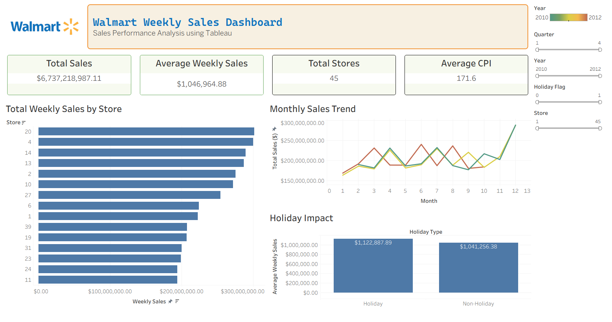

# 🛒 Walmart Sales Dashboard

<p align="center">


</p>

An interactive Tableau dashboard developed to analyze Walmart's weekly sales performance across stores, time periods, holidays, and economic indicators.

The project focuses on transforming cleaned sales data into interactive business intelligence visualizations that help identify sales trends, store performance, seasonal patterns, and relationships between economic factors and weekly sales.

---

# Project Overview

The dashboard provides an interactive analysis of Walmart's historical weekly sales data.

The analysis focuses on:

* Overall sales performance
* Store-wise sales performance
* Monthly and yearly sales trends
* Holiday vs non-holiday sales
* Seasonal patterns
* Economic indicators
* Sales distribution
* Key performance indicators

---

# Dataset

The dashboard uses the Walmart Weekly Sales dataset containing historical information for different Walmart stores.

### Key Variables

* Store
* Date
* Weekly Sales
* Holiday Flag
* Temperature
* Fuel Price
* CPI
* Unemployment

The data was cleaned and prepared before being used for dashboard development.

### Feature Preparation

The original date field was transformed into additional time-based attributes such as:

* Year
* Month
* Week
* Quarter

These fields were used to enable time-based analysis and interactive filtering within Tableau.

---

# Data Preparation

The dataset was prepared using SQL and Excel before being imported into Tableau.

Key preparation steps included:

* Handling missing values
* Checking data consistency
* Standardizing date formats
* Creating time-based fields
* Validating numerical values
* Preparing the dataset for visualization

---

# Dashboard

The Tableau dashboard provides an interactive overview of Walmart's sales performance through multiple visualizations and KPIs.

### Key Dashboard Features

* Total Sales KPI
* Average Weekly Sales
* Average CPI
* Store-wise Sales Analysis
* Monthly Sales Trend
* Holiday Impact Analysis
* Sales Distribution
* Economic Indicator Analysis

### Interactive Filters

Users can filter the dashboard by:

* Year
* Quarter
* Store
* Holiday Flag

These filters allow users to perform focused comparisons across different stores and time periods.

---

# Dashboard Preview



---

# Key Insights

The dashboard enables users to:

* Identify high-performing and low-performing stores
* Analyze changes in weekly sales over time
* Compare holiday and non-holiday sales
* Identify seasonal sales patterns
* Examine relationships between sales and economic indicators
* Compare store performance across different periods
* Support data-driven retail decision-making

---

# Repository Structure

```text
Walmart-Sales-Dashboard/
│
├── dashboard/
│   └── Walmart-sales-dashboard.twb
│
├── data/
│   └── Walmart_Sales_Cleaned.csv
│
├── images/
│   └── Dashboard_SS.png
│
└── README.md
```

---

# Technologies Used

| Category              | Technologies         |
| --------------------- | -------------------- |
| Business Intelligence | Tableau              |
| Data Preparation      | SQL, Microsoft Excel |
| Data Analysis         | SQL, Excel           |
| Visualization         | Tableau              |
| Version Control       | Git, GitHub          |

---

# How to Use

Clone the repository:

```bash
git clone https://github.com/Pranav-1719/Data-Analysis-And-Dashboards.git
```

Navigate to the project directory:

```bash
cd Data-Analysis-And-Dashboards/Walmart-Sales-Dashboard
```

Open the Tableau workbook:

```text
dashboard/Walmart-sales-dashboard.twb
```

Open the `.twb` file using Tableau Desktop.

If Tableau asks for the data source, reconnect it to the dataset available in the `data/` directory.

---

# Skills Demonstrated

* Business Intelligence
* Data Cleaning
* Exploratory Data Analysis
* SQL Data Preparation
* Excel Data Preparation
* KPI Development
* Data Visualization
* Tableau Dashboard Development
* Interactive Filtering
* Time-Series Analysis
* Business Insight Generation

---

# Author

Pranav Sankpal

Computer Science & Engineering Student

Government College of Engineering, Kolhapur

Portfolio: https://pranavsankpal.lovable.app/

GitHub: https://github.com/Pranav-1719

LinkedIn: https://www.linkedin.com/in/pranav-s-sankpal
